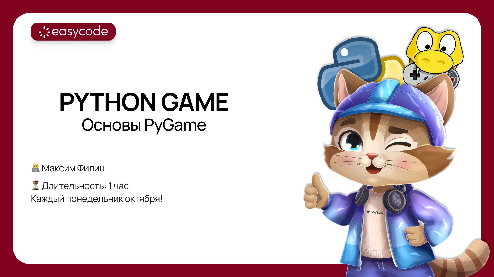

# PYTHON GAME


Приветик всем! Сегодня очень рад был видеть такое большое количество заинтересованных ребят, поэтому как и обещал скидываю вам гайдик по установке Python и VSCode.

## Python
Переходим по этой [ссылке](https://www.python.org/ftp/python/3.10.11/python-3.10.11-amd64.exe), у вас сразу же начнется скачивание. Далее вам требуется сделать несколько обязательных шагов, чтобы все работало корректно. Открывайте сам установщик и прожмите все как на картинках ниже:

### Шаг 1.


### Шаг 2.


### Шаг 3.


Если все повторили как у меня, то все будет отлично и можно переходить к VSCode.

## VSCode
Переходите по данной [ссылке](https://code.visualstudio.com/) и жмите большую кнопку в середине экрана. 


Дождитесь конца загрузки и открывайте установщик. Далее делаем все как на картинках:

### Шаг 1.


### Шаг 2.


### Шаг 3.


## Настройка VSCode

Открываем VSCode. И сразу же переходим к установке расширений: 


Найдите в открывшейся части поиск и напишите там Python:


Когда найдете расширение, то нажмите на него. Откроется вкладка, в которой нужно будет назвать на кнопку "Install":


По своему желанию аналогично можете установить расширение с русским языком:


## Создание проекта
Вернитесь на рабочий стол, создайте здесь папку (ПКМ > Создать > Новую папку) и переименуйте ее в "pygame"

Затем сделайте следующее действие (перетащите папку в VSCode):


Откройте проводник в вашем проекте, если он все еще не открыт. И создайте новый файл main.py:


Вкладка с вашим файлом откроется автоматически, попробуйте написать `print("Hello, EasyCode")` и нажать на кнопку запуска:


## Установка PyGame

В открывшемся терминале напишите следующую команду и нажмите Enter:
```bash
pip install pygame
```
Теперь вам доступна возможность импорта библиотеки

```python
import pygame
```